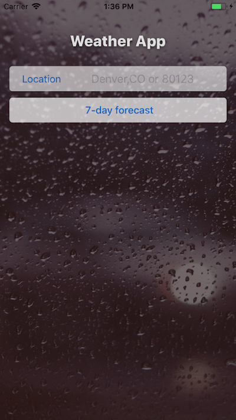
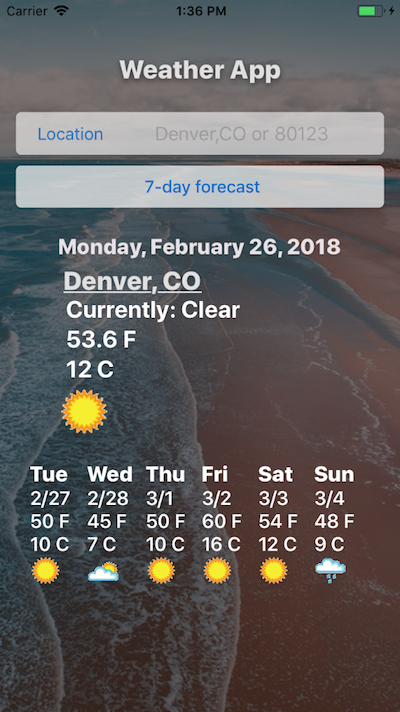
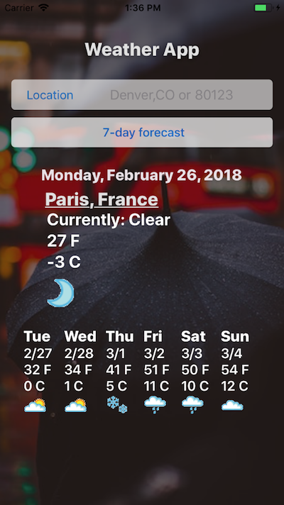
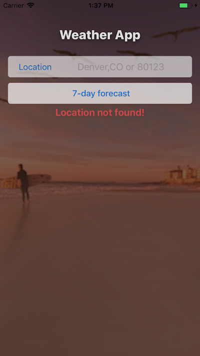

## Weather App in React-Native

### A simple weather App built in React-Native with Weather Underground API
I'm learning React Native, and this is my first project I built. 

This App can:
* look up weather for the next 7 days, starting from today;
* look up weather by the city and state, i.e. Denver, CO;
* look up weather by zip code, i.e. 80123;
* look up weather by international location, i.e Paris, FR;

If the location is empty, misspelled, non-existent, or state is not provided, the error message will show:

*** 

### Author

#### Natalia Calt
